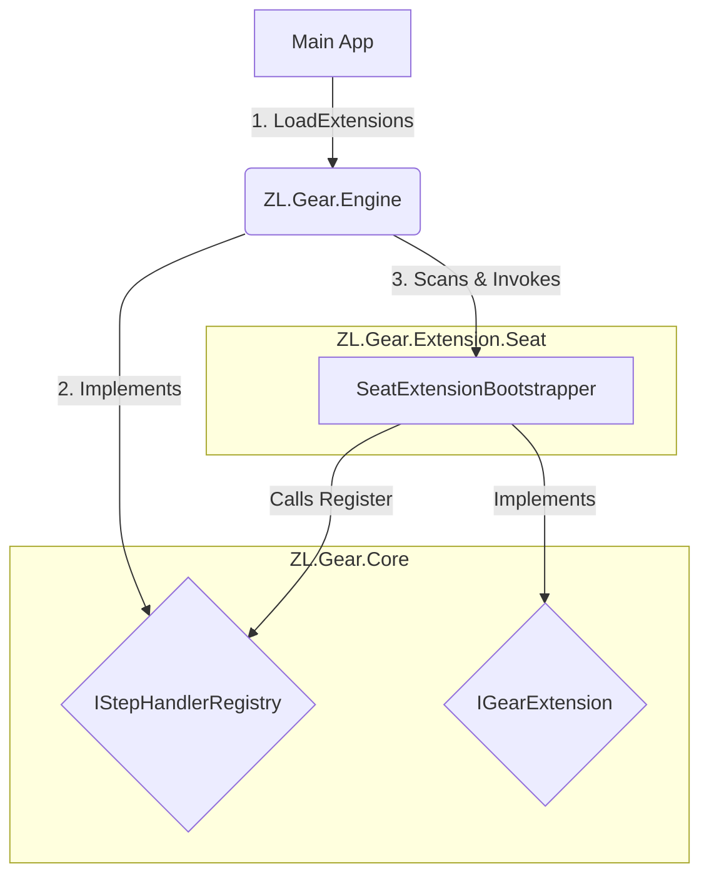

# Markdown File

```mermaid
graph TD
    A[Main App] -->|1. LoadExtensions| B(ZL.Gear.Engine)
    B -->|2. Implements| C{IStepHandlerRegistry}
    B -->|3. Scans & Invokes| D[SeatExtensionBootstrapper]
    
    subgraph ZL.Gear.Core
    C
    E{IGearExtension}
    end
    
    subgraph ZL.Gear.Extension.Seat
    D -->|Implements| E
    D -->|Calls Register| C
    end

```